** WIP: Work in progress. 

This is a sketch of my project.  Written for many audiences.  Everybody has their own process for launching a startup. 

# TECH: VegeMight Stack (VMs) 
For those curious HOW this will be done, please review/comment on [](techstack.md) or [](contribute.md)

# Welcome to 𝒞andꭵ-𝔇⍺𝑡𝑒 Crypto-Mint-Contract & Coin-Op Game Co.

𝒞andꭵ-𝔇⍺𝑡𝑒 "🍭" is a Coin-Operated Blockchain Web3 "gamified experience" to assist engineers find permanent or casual employment.   Candi-Date will hopefully make the sting of rejection feel a bit sweeter. 

𝒞andꭵ-𝔇⍺𝑡𝑒's approach to cognitive-software agent assisted - asynchronous global job-search is well suited toward highly specialized technical job roles such as engineers and scientists.  These often have diverse specialized skill requirements and people with complex evaluation criteria (skills/stack, job location, language, hours, commute, perks, etc.)

If you are un-employed or under-employed technical Engineer, Programmer or Scientst (*OR* seeking the latter) then 𝒞andꭵ-𝔇⍺𝑡𝑒 is being built for you.  By now you realize covid broke the job-search by creating thousands of different Work-from-your-arse scenarios, searching is tedium, we must adapt to the new world. 

𝒞andꭵ-𝔇⍺𝑡𝑒 is a unique way new way to speed-match peoples & roles in agent-assisted gamified rounds called "Candy Dates" based on natural language conversational processing.  The chat is done with contextually aware cognitive agents representing both sides.  The tedium of looking for work is best suited to a personalized algorithm which is individually curated using a process known as "supervision", but ultimately candy-dates are like sending your robot mate to find a date.   The interaction between the two agents is moderated by Errs "👽" the Electronic Records Retention system. 

𝒞andꭵ-𝔇⍺𝑡𝑒 hopes to disrupt the present-day assymetric hiring/job seeker paradigm that is time wasteful and where job descriptions are often 'aspirational' and written in ways that they do not properly capture the factors which are the basis of evalulation criteria.  Especially since many companies that have embraced WFH are able to hire from a global candidate pool - the historical hiring methods are absolutely inadequate. 

The "🍭" Candi-Date expects accesses a global workforce using blockchains & Proof of Stake "🥩" ("steak"), with the employees/contractors offering 🍷 ("wine") as a means to build trust and demonstrate mutual commitment to meeting on a Candy-Date.  The Candy Date offers both parties nominal compensation for attending the interview, and is gamified to incentivize the candidate to answer once using a block-chain and for provide both parties with a more transparent approach to the entire process.  Companies which like the old (broken) way of hiring, this is not for you. 

Finally, for large companies which already have agents screening their incoming resumes, this system is envisioned as an API driven feed for whatever you've already got. 

# Work in Progress

Building a company is lonely.  I'm hoping for one or more co-founders, technical-recruiters or other interested parties to flesh out these ideas. 

```mermaid
sequenceDiagram
    participant B as wants Job
    participant AgB as Agent 🤖
    participant E as Errs Blockchain 👽
    participant AgC as Agent 🤖
    participant C as has Role

    Note over B,E: human WANTS JOB 🧻
    B ->> AgB: here is my CV
    AgB -->> B: ask questions
    B -->> AgB: 👍 answers
    AgB->>AgB: Formatting
    AgB->>AgB: calculate HyperParameters, ZK proof
    AgB ->> E: register, wait ...
    E ->> AgB: welcome, enjoy 🍷 while you wait.

    Note over E,C: org HAS JOB 🧻
    C ->> AgC: enroll company in Errs 👽
    AgC ->>E: register wallet
    E ->> AgC: welcome, promotion: FREE 🥩 for 🧻 offer
    C --> AgC: CREATE role(s) 🧻
    C ->> AgC: UPLOAD role 🧻
    AgC->>AgC: Formatting Q&A
    AgC->>AgC: calculate HyperParameters, ZK proofs
    AgC ->> E: transmit VALID role 🧻 
    E --> AgC: 🧻 role ACCEPTED

    E ->> AgB: role 🥐 WAITING
    AgB->>AgB: SCAN SUMMARY

    Note over AgC,AgB: 🧠🤖🍷💌🥩🧻🤖🧠 agents negotiate 

    AgB ->> AgC: REQUEST PUBLIC 🧻, proffer 1🍷 & identity
    AgC ->> AgB: transmit PUBLIC 🧻
    AgB -->> AgC: send 1🍷 expect 1🥩, SKILLS: partial (incomplete), IS sufficient?

    AgC ->> AgB: Vaccination Status
    AgB ->> AgC: Yes 👍 
    AgC ->> AgB: ATTACH FILE request
    AgB ->> AgC: DONE
        
    
    Note over AgC,AgB: TODO: 🤮 UNACCEPTABLE
    Note over AgC,AgB: TODO: 🥸 DISCLOSE MORE
    Note over AgC,AgB: TODO: 😁 HAPPY

    AgC ->> AgB: transmit REQUEST 💌 + 1🍬 "Candy Date" OFFER 0.50🥩 EXPECT 0🍷
    AgB->>AgB: SCAN SUMMARY


```




# What types of criteria?
Ultimately there are too many micro-reasons a job may or may not be a good fit. 

```
    Location
        Nearby
            Can Walk
            Must Drive
        Far Away
            Will Relocate

    Health Insurance

    Hours & Days for Work
    Hours per Week
    Childcare
    Gym On Site
    Sushi Lunches

    what is your age range
    what is your ethnicity
    which gender do you identify with
        Female
        Male
        Non-binary
        Transgender
        Gender neutral
        My gender identify is not listed
        Prefer not to say
    Disability
    Captchas - Prove you are human

    have you served in the Some-Country Armed Forces
        Yes
        No
        Prefer not to say

https://www.useweb3.xyz/engineering-jobs?page=2
```


* PROFFER

    B->>AgB: ?
    loop Healthcheck
        B->>B: Fight against hypochondria
    end
    Note right of A: Rational thoughts <br/>prevail!


### Why this/why now - 

After covid employment, negotation of in office, work-for-home or work-anywhere organizations such as DAO's & early adopters of Web3 the fundamental posture of work has changed, candidates can be anywhere yet our traditional means for hiring has not adapted (yet).  


The Internet made the planet smaller and Covid changed the work-from-home rules.   We as a society haven't updated our HR practices (yet) to reflect this new global village we all inhabit.  There are more candidates and increasingly greater specialization.  HR departments are NOT equipped to keep up.

Using 𝒞andꭵ-𝔇⍺𝑡𝑒 stops:

    * being directly rejected, or getting a non-response/no-feedback/ghosted 
    * wasting lost-hours wading through poorly written & inaccurate job-descriptions
    * attending one or more poorly conducted "technical" interviews
    * being forced to disclose ALL personnel details to prospective employers too early in the hiring process (often before the interview)
    * reject roles with a dysfunctional person or team without even meeting!  
    (Hint: there's often a REASON why the role is empty) 
    * financially dis-incentivize the types of orgs that use 'traditional' job boards for smishing, spam and/or unpaid internships.
    * prevent anybody being insulted by offers such an unpaid internship that requires a PhD and 5 years of experience just to apply.  <-- these can stay on the old job boards.
    
The 𝒞andꭵ-𝔇⍺𝑡𝑒s process will make sourcing humans easier & maybe even a bit fun for both parties by gamifying the engagement. 

The approach requires Employers (or Recruiters) to have steak'd 🥩 in-game currency for to arrange a 𝒞andꭵ-𝔇⍺𝑡𝑒.  The steak must get bigger as more alignment is found and after each interview a portion of the stake is carried forward, returned to the company and/or paid to the individual(s) who are applying.  see [notes/tokenomics.md]() for a discussion of the game mechanics (seeking comments)

Asynchronous cohorts encourages fast & timely answers to questions (via supervised or unsupervised agents).  Agents can access the historical answers for training,  and use that information to best decide if the individual or company they represent is qualified/interested before submitting a 𝒞andꭵ-𝔇⍺𝑡𝑒 proffer to the other party.   

Think of 𝒞andꭵ-𝔇⍺𝑡𝑒 like an online decentralized blockchain job-fair in a free-market society. 


## Fair Unbiased Skills based Robo-screening

𝒞andꭵ-𝔇⍺𝑡𝑒s is NOT a recruiting service, and Recruiters can use 𝒞andꭵ-𝔇⍺𝑡𝑒 on behalf of employers they represent. 

𝒞andꭵ-𝔇⍺𝑡𝑒s does NOT tell companies who to hire, it simply acts as a faster, parallelized, cognitive search & match-maker in the cloud.  𝒞andꭵ-𝔇⍺𝑡𝑒s informs both parties WHY they should talk, or why they aren't a good fit. 

Building machine agents to do a lot of the small-talk aspects for both parties and provide transcripts .. have you ever heard the expression "I'll have my people talk to your people?" .. this is the same idea, except we're using cognitive agents instead of people. 

The present-day search-interview-hire process has substantial systemic wasteful duplicative-effort, it's slow and HR people are really poor at qualifying technical candidates.   Too much energy goes into human level scanning, qualifying, hiring & reviewing employment offers.  The whole process is absurdly wasteful and full of human prone selection bias.  

## Why use 𝒞andꭵ-𝔇⍺𝑡𝑒 to finding good roles & technical people?

Searching for a role or person should not be a full-time job (certainly there are better things a person could be doing in that time such as painting, poetry, or programming).  The collective cost feels untenable, it is a burden to humanity perpetuated on us all by a pox of outdated inept antiquated HR practices.  

Ultimately good people stay in bad jobs for a number of reasons including the pain of finding a better/different job -- this only masks a bigger problem in our society.  

𝒞andꭵ-𝔇⍺𝑡𝑒 Crypto-Mint & Coin-Op Co. will both automate & asynchronously parallelize the processing.   The automation will reduce the costs for companies & unrecoverable time for candidates by eliminating the toil. 

The practices are designed to reward good actors and nominally punish bad actors.

### For Engineers

For Engineers Earn spendable crypto-coins for interviewing asynchronously, conversationally.  The interface is command line/menu driven inspired by "oregon trail".   Training an ai-bot 'agent' about your work preferences is easy using freely available large language models.  The agent learns how to complete job applications & perform pre-interviews to eliminate this toil from your life.  You can run your agent in supervised or unsupervised modes of operation.  Real-crypto coins are intended to be used (or gifted) as game-pieces for coordination by a decentralized blockchain.  Some aspects of 'how' the privacy is accomplished are agents' coordinating zero-knowledge proof exchanges. It is not necessary to know any of this to use the software, but rather to illustrate it's sufficiently different to whatever job-board or tool you've perhaps used in the past. 

𝒞andꭵ-𝔇⍺𝑡𝑒 will be free to sign up, people can earn free coins daily, early adopters have more experience! The tokenomics of the blockchain app are early-stage, but there will be a freemium 'pay for more' model principally to prevent job-spammers and give runner-ups who might spend hours doing exercises some consolidation, gratuity or appearance fee that I expect *might* buy a consolidation coffee for taking the time to do a 𝒞andꭵ-𝔇⍺𝑡𝑒.  I expect the application to either be inexpensive enough that I can afford to run it, or become big enough that it will pay for itself on the Freemium model.  VMs runs on your computer not mine, so hopefully you have a fast GPU. ;-)   

### For Employers
For companies looking to hire, there is an honor policy where your coins are due at the end of the hiring round.  Always pay bills, it's a blockchain, it's public information, your account will still work, but you'll *hopefully* experience bad-luck getting qualified 𝒞andꭵ-𝔇⍺𝑡𝑒s to agree to meet!  Outstanding liability to the blockchain/network, just like credit-scores it's better not to let accounts go or remain negative (𝒞andꭵ-𝔇⍺𝑡𝑒s themselves are social credit scores).  The fees are going to be very low, and they basically serve as a nominal in-game currency for 𝒞andꭵ-𝔇⍺𝑡𝑒, and the game itself operates as a match-making service.  The coin itself may have no value, it's a coin-op smart-contract.  

The application is targeting multi-chain multi-coin crypto-L2 which adds a lot of complexity, so the VMs is robust & inexpensive and the data never leaves a VM on your computer or network.  𝒞andꭵ-𝔇⍺𝑡𝑒 is significantly more privacy minded despite coordinating actions on public blockchain(s). 

For Companies - interview more people faster, in parallel, literally the agent could pre-interview and qualify thousands of engineers to start from a better (hopefully smarter, more qualified) candidate pool.   These are pre-interviews, a faster method to sift through the candidate pool, you still meet people face to face using Teams, etc.  that's a 𝒞andꭵ-𝔇⍺𝑡𝑒!  The quicker pre-interview survey approach helps companies narrow in, or broaden their search parameters. 

𝒞andꭵ-𝔇⍺𝑡𝑒 will record the status on a per domain/ERC-20 wallet, and expect companies hiring to pay a nominal fee upon success or closure of a round.  I want to stress this should be in the hundreds of dollars, not thousands, so there is plenty of headroom for agencies.  You can even use 𝒞andꭵ-𝔇⍺𝑡𝑒 with VMs to process your own candidates.  𝒞andꭵ-𝔇⍺𝑡𝑒 is intended to plugin to network architectures with AD, SSO, Crypo-wallet controls and breeze through ISO-27001 and SOC2 zero-trust security postures.  You can run 𝒞andꭵ-𝔇⍺𝑡𝑒 entirely locally with your own jobs@domain.com inbox, the 𝒞andꭵ-𝔇⍺𝑡𝑒 auto-responder works both ways and while it prefers matrix.org, discord, teams, slack, or telegram it will ALSO work with email and attachments.  

The network itself has memory, so the longer you're registered on 𝒞andꭵ-𝔇⍺𝑡𝑒, the more experience you have.  Many aspects probably haven't been fully thought out, so much of this text is aspirational.  The 𝒞andꭵ-𝔇⍺𝑡𝑒 wallet's are expected to be organizationally soul-bound to domains. 


## Subject:  Candꭵ𝕥e(®️) Looking for Contributors, LMK!

The project plan. v0.0.2

𝒞andꭵ-𝔇⍺𝑡𝑒 is a HR/Recruiter gamified crypto-currency AI chatbot equipped with Large Language Model for conversationally pre-screening "qualifying" job details.  
The bot can speak async chat or email and hopes to setup/follow up on & arrange 𝒞andꭵ-𝔇⍺𝑡𝑒s, which are a combination of virtual chat & in-person or virtual meetings. 

I have sufficient capital resources, time & code-skill to build this.   Please consider the software itself as a coin-operated machine that just happens to run across decentralized blockchains and requires agents to negotiate the exchanging of small sums with zero-knowledge proofs.  
I hope it will only take 6-10 weeks of solid effort to produce an MVP, so I'm allocating 12-week (3 month) spring to see how far I can get.  Working on projects without validation is extremely difficult so if this sounds like something you might try once it's finished I really encourage you to consider sharing & commenting early in the development process. 

Expressions of interest, kind words, and polite criticism are welcome. 

Nominal crypto-donations in ETH, MATIC, DOTS, or SOL are the 'in-game' currencies, DAO coins are welcome.   Financial contributors or those who help develop this should receive an expectation of large reciprocal airdrops & future invitations to join/vote in the #governance channel.  𝒞andꭵ-𝔇⍺𝑡𝑒 may add other coins, especially DAO coins in the future and hope spending the extra time to setup PolkaDot as a way to span multiple chains means the application is properly destructured to take avantage of whatever innovations the blockchain can deliver in the future.   Again, the reason for supporting different currencies in the first version is to ensure the architecture is sufficiently decoupled. 

The wallet I've listed in the [contribute.md] section is the one I will use for my soon-to-be-formed AU RDC (non-profit Research & Development Corporation) as a DAO.  I'm just trying to establish good automata custodial processes that can pass ISO 27001/SOC2, GDPR data retention without too much heartache & auditing expense (to keep this legal, i.e. if large companies are ever going to use this, these security & privacy controls).  
 
 Because I'm building this in Australia (VegeMight stack) -- despite actual Australian Vegemite from being illegal in the US - VegeMight Stack & 𝒞andꭵ-𝔇⍺𝑡𝑒 will both adhere to 
 AU & US employment, privacy & securities law (and probably EU too, but I'm not an expert here).   𝒞andꭵ-𝔇⍺𝑡𝑒 will have wagering "staking" (except, we call it "steaking" as in 🥩) - this is an offer mechanism to encourage people to apply for & attend 𝒞andꭵ-𝔇⍺𝑡𝑒s with an organization, for a small portion of the 'steak'.  𝒞andꭵ-𝔇⍺𝑡𝑒 is about speed-searching - getting people into roles much faster using machine learning and natural language processing.  Everybody should be able to play the game and hopefully feel a bit less stinging rejection and also a good way/place for engineering students to coordinate on projects with others outside their school & social circle.  

The work is licensed under the Elastic V2 License, specifically to prevent cloud-companies such as Amazon from taking this work and creating a profit-oriented dystopian community-harming fragmentation.  I'm surprised Amazon hasn't started charging people an application fee to apply to work there.  


## Who will use Candꭵ.ⅆa𝕥e(®️®️)?
This is written in an idiomatic venacular built for 𝟚 primary audiences &  𝟚 secondary audiences. 

👽: The word "Errs" refers to Employee Recruiting & Retention System for 𝒞andꭵ-𝔇⍺𝑡𝑒. 

### (1.) seekErrs - 'seeks job, will date, want candy'
* 2(A): young engineering or science students who are starting their careers
* 2(B): older versions of the same
* 2(C): self-taught non-credentialled technical people
* 2(E): Person who are already employed, but curious & open to switch. 
* 🤓 Learn More: [notes/seekErrs.md]()

### 2.  hasErrs - 'has job, offers candy, seeks date'
* 2(A): HR & Talent Recruiting professionals
* 2(B): Companies which seek IT expertise on full or part time or casual contracting
* 2(C): IT or Engineering departments looking for candidates
* 2(E): Academic instutitions with Education or undergradate opportunities
* 🤓 Learn More: [notes/hasErrs.md]()

### 3. DAO's (seconday audience)
* 3(A): DAOs decentralized autonomous organizations are crypto-native organizations. DAO's can also use 𝒞andꭵ-𝔇⍺𝑡𝑒, keen to discuss your specific recruitment needs.  

* 3(B): DAOs in particular are unique from a recruiting fit because they are 'volunteer to work' and allow a person to sign up for a job where they may be paid based on recognition for work/effort they contribution.

### 4. Hackathons (secondary audience)
𝒞andꭵ-𝔇⍺𝑡𝑒, specifically VMs will provide a jump-box or staging area for teams/groups to form hackathons related to blockchain or artificial intelligence. 

## The how-why to enroll, play, & win
You download the software and run it on your computer.  See [install.md]() for more. 

Training a cognitive agent happens in conversation chat such as discord, or via the command line.  It uses a ubiquitous 'card' design approach, so you can build whatever interface you'd want.  You provide positive or negative reinforcement based on how the agent might answer the card for you. 

The Errs agent ("👽") is running in your device, and as long as you don't accidentally make it G/AI it will remain in the VMs, it's a 'smart auto-responder', not a gimmick, a real agent with cognitive skills in your PC that can drive software.  That is the goal of Errs, and the 👽 to represents. 

👽 builds a profile about a company & role -- requirements and attempts to find opportunities specifically companies who are or plan to use specific technologies, but this is not an SQL keyword join, it's a synaptic join by a large language model. The assumption is that it could daily scrape job boards or corporate websites. 

Stop wasting your time reviewing roles each day - stop interviewing, do something else productive.  The number of garbage jobs clogging up the hiring sites is disturbing and the existing job sites lack the tools to properly categorize or filter these. 

Enhanced Privacy: Questions & answers will be classified by sensitivity, such that there are both public and vaulted (a true encrypted key-vault).  Access to vaulted information requires coin staking and both agents build detailed profiles of questions & answers between candidates using github issues.

* http://Candydate.xyz : corporate website
* http://Candydate.eth : onboarding
    * erc-20 wallet
    * discord


## Feedback is welcome
[contribute.md]()

### Find me at Matrix.Org:
![][image_ref_a32ff4ads]

[https://matrix.to/#/#candydated0txyz:matrix.org]()


### Check Twitter for Updates:
<!--
https://img.shields.io/twitter/follow/brianhorakh?style=social
-->


[http://twitter.com/brianhorakh](http://twitter.com/brianhorakh)


[http://twitter.com/candydatexyz](http://twitter.com/candydatexyz)


## What kind of org 𝒞andꭵ-𝔇⍺𝑡𝑒

𝒞andꭵ-𝔇⍺𝑡𝑒 the organization will run similar to Wikipedia as a not-for-profit (freemium-paid for sustainability & spam-mitigation) operating model and so we hope prospective employers will embrace 𝒞andꭵ-𝔇⍺𝑡𝑒s as a better way to find & hire especially machine learning & web3 engineering talent.  


<!--

-->


# 🤓 Technical Detail & FAQ

## 👋 Dear Recruitsers
Dear Recruiters, I will pay you in crypto-currency to answer these questions and screen these emails & process better.  The job descriptions are poor quality, they need a higher degree of word precision related to the environment existing vs proposed/nice.
Less repetition (the answers don't change, so this does a better job screening, asynchronously via chat).  The follow up with the person offering the job is too cumbersome, the whole process is very poor. 

 Where companies and employees can upload their encrypted profiles, link their organizational accounts, and have bi-directional robots converstationally take turns in successive-rounds finding and eliminating candidates until a position is filled. 

Don't worry, it's easy to use because everybody starts with 1,000 free tokens sponsored by "𝒞andꭵ-𝔇⍺𝑡𝑒" Crypto Coin co. a command line driven "cli" / interactive menu driven/run on your own machine. 

You can power the system and generate coins by joining and it is mostly explained below. 

Candꭵ.ⅆa𝕥e is a conversational AI that simplifies the review &
processing of both job advertisements and CVs. 

### 👋 Hi from Melvin 
🤓 "Melvin" (the nerd emoji) is for technical specification hints/background.  Melvins can be difficult to understand for some non-experts.   For experts in the AI & blockchain field these specifications are very important because they remove ambiguity.  If you see a Melvin and you don't understand what it's saying, thats fine - it's probably not important and you can skip it. 

The 𝒞andꭵ-𝔇⍺𝑡𝑒 system is designed to introduce new skills to the user to play the game as part of an interactive find-hire-work humorously named Errs (produced like Errors)

### 🤓 𝒞andꭵ-𝔇⍺𝑡𝑒 and the Vegemight Stack
🙏 𝒞andꭵ-𝔇⍺𝑡𝑒 will recycle the good ideas from my earlier work \_b00t\_ but will incorporate RUST Cargo, WASM and deno (all were absent from \_b00t\_) called the Vegemight Stack (as opposed to the JAM stack, which also goes on toast).  Vegemite is a popular Australian breakfast spread, that is illegal to import to the US.  The Vegemight stack was designed in Australia.  The naming convention also removes the mandarin pinyin in favor of all shorthand emoji. 

### 🤓 What is the VegeMight Stack (VMS)?
VegeMight Stack (VMS) is intended to provide simplification of complex 'highly-technical' machine-learning stacks device-deployable multi-os build & packaging system using WASM (web assembler) which allows polyglot coding between Rust, TypeScript, Python and C++ (at least these) and a full build of Linux & OCI containers running the deno serverless engine.  If any of the information I just said made sense to you then you *might* be qualified to read the [techstack.md]()

### 🤓 What is/was \_b00t\_
Vegemight is a refactor of the good ideas from [http://github.com/elasticdotventures/\_b00t\_]() into Candꭵ.ⅆa𝕥e(®️®️) v0.0.1 using cargo - second attempt at a universal installer for less/least technical people.  But this is mostly intended for technical recruiting initially. 

### 🤓 How much crypto-currency will a 𝒞andꭵ-𝔇⍺𝑡𝑒 cost? 
Neglible real dollar amounts, pennies or less.  It's Freemium business model with lots of coins getting dropped.  The system will be very efficient, especially ETH2 post merge, the fees will be very low, and the candidates are pre-screened.   While there is crypto-currency, the idea is to keep the fees very low and the crypto is a way to reward individuals for successfully completing steps.  Maybe the crypto will be working someday, but that isn't why people are playing the game.   It will take probably 6-10 weeks to build the prototype system, or something that resembles a prototype? It's unknown how long it will take to get connections to networks & exchanges setup. 

## Present obstacles
``` 
# installing gh repo is bumpy.  that happens pretty earily in the install. 
gh repo clone elasticdotventures/candydated0txyz

```

🙏 Please be patient. Rome was not built in a day. 

## example file & directory structure, for tasks & chores
* [n00b.md](n00b.md) what is 𝒞andꭵ-𝔇⍺𝑡𝑒 for n00bs (beginners)
    * how to sign up and get into queue
* [contribute.md](contribute.md) How to contribute
    * github issues on this repository. 
    * i'm accessible. plenty of ways to reach me. twitter,linked in etc.
* [techstack.md](techstack.md) Technical stack specification
    * explains directory structure
    * overview of which tools will be used
* 🤓 Detail
    * [tokenomics.md](tokenomics.md) crypto-currency
    * [cognitive.md](cognitive.md) AI/ML/NLP/LLM
* 😁 In Progress
    * [TODO.md]() my priorities


## 𝒞andꭵ-𝔇⍺𝑡𝑒 Operational Summary

👋 I'm just starting to organize this for peer validation.  
🙏 Thank you for your time.  Please checkout contribute or follow me on twitter, linkedin, whatever social media you happen to use. 

To help visualize the game-format and operation of 𝒞andꭵ-𝔇⍺𝑡𝑒 it is helpful to envision a game of telephone with an AI Large Language model in the center relaying answers between two parties 



```mermaid
sequenceDiagram
    actor S3 as jobSeekErr 3
    actor S2 as jobSeekErr 2
    actor S1 as jobSeekErr 1
    participant A as Agent.🤖
    actor V1 as verifyErr1
    participant CD as CandyDate
    S1 ->> A: send resume/cv
    V1 ->> A: send job description
    S2 -->> A: send resume/cv
    S3 -->> A: send resume/cv
    A ->> CD: most qualified move forward to candydate (next async round of questions)

```

The same agent is scanning multiple resume/cv's and job-descriptions and learning both parties individual preferences based on feedback it solicits trying to confirm answers. 

## Simplified Operation

Please realize the process as described below is happening for many weight attributes per candidate and validator (organization) to improve accurate. 


The agent name is Errs (Employee Recruitment & Records System).

This is not a SAAS, this is decentralized, you must run your own Errs system
locally since the app deals with crypto-currency & vaulted-wallets. 

The agent instructions are to prevent disclosure and compartmentalizing information received by each party.   

Please do not confuse this with other job-search websites.  Technically under the hood of the software it's using an entirely different type of engine that is far more clever. 

This is not an SQL join like traditional job sites, this is a join based on unsupervised reinforced cognitive inference using:

* NLP Natural Language Processing ... "conversational AI"
* GPT Generative Predictive Text ...  "generate & autocomplete sentences"
* LLM Large Language Models    ... "larger usually means 'more clever & intelligent'"

𝒞andꭵ-𝔇⍺𝑡𝑒 will perform many pre-qualifying speed dating rounds, in parallel,
and when necessary reaching out to either party to confirm answers to questions.

The system is intended to be pragmatic pairing requirements such as skill & office-location or wfh schedule, many facet matching & role filtering.  

Once Errs auto-pilot is primed with either a CV or Job description it analyize job history, hiring profile and other details which may demonstrate biases and help candidates not submit if they are likely to be rejected.  

Each persons private information is put into one system and it is only provided to job roles which found agreement on suitable pre-requisite matches for both parties (or was disqualified, in which case the result fails, and waits for a different 𝒞andꭵ-𝔇⍺𝑡𝑒.)

This also means qualified 𝒞andꭵ-𝔇⍺𝑡𝑒s (and their agents) can talk back at the job via chat.  Neither party actually exchanges information until long it is was matched by Errs.  Errs sits in the middle of all the conversations as a cognitive privacy screen. 

At this stage i'm still building the installer since this needs to run on peoples computers or business networks and connect to single service sign-on settings and whatnot it's fairly complex.   The installer will be the most complex aspect since it will require I setup a neural net directly on the users machine (in their browser) so that I don't need to store information.  

It's a local installer because it stores security keys, wallets, confidential information.   The message passing happens via an API on the cloud, but the processing is local or can be deployed to a cloud and I may offer a hosted version as well. 

## Conceptual seekErr to Agent Workflow
  _the chart below should render in mermaid charts_

```mermaid
sequenceDiagram
    participant S as seekErr
    actor S
    participant A as Agent.🤖
    S -->> A: 🙏 𝒞andꭵ-𝔇⍺𝑡𝑒 plz? 
    A ->> S: /say Install Software Stack okay?
    S -->> A: 👇😱 no. got error. something bad! 
    A -->> A: 👇👹 oh-no, software is required. contact. will fix.
    A ->> S: /say is fixed?

    S -->> A: 👍 okay, done. software installed.
    A ->> S: 🐙 setup go to github.com create account.
    S -->> A: 🐙👍 okay, have github account
    A ->> S: 🐙🔗 now link github account to software
    S -->> A: 👍🐙🔗 okay, linked github account

    A ->> S: 🧱 Create ERC-20 Wallet (use software)
    S --> A: 👍🧱 okay, have wallet
    A ->> S: 🦊💌🧱 Add Wallet to Browser MetaMask plugin

    A ->> S: 🦊🔗🤝 Link wallet at http://candydate.eth
    A ->> S: 🦊🔗🐙 backup wallet in github vault
    A ->> S: 🦊🔗🪩 Link wallet to discord id chatbot
    A ->> S: 🦊🔗Ⓜ️ Link wallet to instragram
    A ->> S: 🦊🔗🐤 Link wallet to twitter
 
    
    S --> A: 👍 wallet is link(ed), coin awards!
    A ->> S: 🧛‍♂️ associate SSO accounts, get coins

    S --> A: 👍 enroll using SSO
    A ->> S: 📄 Upload CV Resume documents, get coins
    S --> A: 👍 anwer questions (optional) - each day, get coins

```


# Aspirational goals
Some of the aspirational goals of this repo is to produce artificats that appear in every app store.  The initial configuration(s) selected must be broad enough that they can begin & ultimately pass the certification processes for Google, Microsoft, Apple, etc. A software project like this is never complete.

🙏 the goal is to eliminate the toil, and setup what are effectively install a plurality "spinning-rims", once the software is setup and installed we'll have lots of features but before that we need to do a bunch of foundational cybersecurity housekeeping tasks to be able to pass future ISO27001 software audits and offer corporate organization SSO for organizational crypto-wallet & gamified hiring process with AI natural language agent in the middle - it's a project. 

This project specifically uses the NLP LLM generative AI to perform data-privacy and anonymouse.🐭  Your information remains encrypted on your machine or in your github.com or similar vault.  For companies hiring technical people this system allows you to post job descriptions directly into IpFS under your own organizational repo.  

One aspect that is difficult about launching a system like this is both 'want job' and 'have job' persons (seekErrs & valiDatErrs respectively) must arrive at roughly the same time.  To mitigate this requirement this is being designed inside out. You get as far into the process as you can.  Use github issues. 

### TLDR: Advanced Route (present)


* install WSL2 ubuntu 22.04 LTS
    * 🤓 reference https://ubuntu.com/wsl
    * 🤓👍 as of writing these documents describe older versions 20.04 (please modify)
    * 🤓👍 this may work on older builds but I can't promise anything, please report success

* install RUST using rustup
    * 🤓 reference (below)

* i need to figure out how to install a lot of RUST packages in a workspace, but this will ultimately a system within a system.  so the user experience starts with the installer. 

* every module, sugar-syntax, etc. should have an install.sh
* FUTURE: install.sh will be convered by bats (bourne again test scripts)
* the big challenge is starting from a mostly bear system. 

```bash

~./install.sh

# this is easy because it means there can be a local system template created by
rm ~/.candy
git clone --template /mnt/c/0de/candydated0txyz 

# now grab the repo using git, or gh client
git clone  /mnt/c/0de
gh repo clone ...

# 
cd ~/.candy 
cd /mnt/c/0de/candy

# minimal getting started, begin tutorial:
cargo install 
# 🤓: this should automatically do all the commands below.

cargo test
cargo run


```

## Contribute
see [contribute.md]()

### Source of Truth

The purpose of this respository is to establish a foundational document and source of truth for the project in a version control system.  

# Keep it simplest terms:
* organizations (called validators) have rolls, want dates to interview & fill
* candidates want rolls, seek dates

# How the bot works:
The bot will camp a variety of online communities and monitor profiles, and curate data on people who have indicated they may be looking for a role. 


# Frequently Asked Questions


## When should I register for 𝒞andꭵ-𝔇⍺𝑡𝑒?

The short answer is pre-register as early as you can, socialize and expect a future bot to scan your social media feeds and reward you.  

This project operates on the concept of epochs, and so new players will have higher costs than established players, in a mechanism similar to feedback.  When eBay first started nobody had feedback and it wasn't important. 

## How can I help?
see [contribute.md]() 

If you are an HR person for a large company with more than 100 open technical roles please ping me directly if you would like to be included in our pilot & planning.  

If you are DAO who is keen to use 𝒞andꭵ-𝔇⍺𝑡𝑒s as a bridge to traditional non-DAO candidates (necessary for growth & expansion outside the present-day highly insular Web3/Blockchain/Crypto-Currency communities) then I'd also love to hear from you. 


## This sounds disruptive to traditional HR hiring - is it?

Yes - of course.

Consider the nature of present day 'hiring' resumes/cv's and white collar work generally began in the 1930's and is less than 100 years old. As a society, 100 years is generally the point where it either breaks-down or will it persist as a 'mostly email' system for the next another 100 years?  I think the idea that other technology keeps moving at hiring remains at it's current pace and nothing will ever change -- doesn't that sound ludicrous and laughably wrong? 

One goal of VMs is to highlight areas where & how blockchains & open-source machine learning may be used within an organization.   This project has all the hallmarks of a successful innovation pilot, it will gentley cover how to set & secure organizational crypto wallets (in vaults).  

## Can my company use this?

There is a reason I'm planning ISO27001 and AD SSO roles in v1.0 in the first versions - it's because VMs is a stack, and 𝒞andꭵ-𝔇⍺𝑡𝑒 is a tool.  It would be great to have big employers or DAO's ready to participate at the launch.   

## The old way works - so Why would my company use this? 

𝒞andꭵ-𝔇⍺𝑡𝑒 was invented out of necessity to help humans stay competitive with the robots that will ultimately replace them in the workforce.  

In a scenario where 𝒞andꭵ-𝔇⍺𝑡𝑒 is wildely adopted it could only give humans in the workforce an extra decade - that is best case.  On the Internet nobody cares if you're a robot and now it's only a matter of time. 

Artificial intelligence is according to many informed opinions the most significant discovery humanity has made in the past 10,000 years (basically since 'fire, villages & the wheel'). 

But AI is still so new and so specialized we don't really understand the long term impact.  Companies that aren't actively looking for places to put AI into the processes are not the concern, they can remain living in their wet dark cold cave and die there. 

𝒞andꭵ-𝔇⍺𝑡𝑒 is described as a more 'optimal system' to discover & filter people for more technical roles.   The ethos of 𝒞andꭵ-𝔇⍺𝑡𝑒 is to simplify the repetitive toil of finding roles especially those with highly specialized knowledge domains.  With the hindsight of email & spam - 𝒞andꭵ-𝔇⍺𝑡𝑒 is designed to be an affordable, 'free to play' dynamics - where everybody is a bot and so only well behaved bots can actually afford to run.  

This is the "why", and the "how" is still being written - but v1.0 (whatever & whenever that is) will use NLP LLMs and GPT for performing synaptic joins instead of conventional SQL.  Conventional SQL is fine for antiquated job boards with limited attributes, they are better suited for blue-collar & white-collar lower-technical mostly interchangable roles but they lack the nuanced aspects of hiring for technical roles.  

As engineers our programming conventions have moved from imperative to functional declarations but our job search is still tedioiusly synchronous and procedurally imperative.   𝒞andꭵ-𝔇⍺𝑡𝑒 will disrupt that by any means necessary, also big companies are probably already using some form of resume scanning software - so in a way 𝒞andꭵ-𝔇⍺𝑡𝑒 is just intended to make the playing field fair. 

Anybody who is looking for or hiring for highly technical job roles is encouraged to join and contribute to 𝒞andꭵ-𝔇⍺𝑡𝑒, follow this on twitter, or reach out and let us know if/how you'd like this to work. (or how NOT to have it work)

This feedback is appreciated and helps inform the final version be better.  Ultimately operating the system will require (at least initially) some modicum of supervision & training but the goal of the deliverable is to make something so idiot proof even an technophobic HR person could use it (even though that isn't the audience, ultimately they are the gate-keepers in big companies). 


## SAAS vs. Install

This is designed to run on your computer, 
or via a website in your browser our on device for security reasons.  

There may be a SAAS hosted version.   Several people have told me that I should do a SAAS version. 

This uses a block-chain for coordination but not sensitive information is published there.  The block-chain requires a wallet. 

### What is Github.com and why do I need an account? 
𝒞andꭵ-𝔇⍺𝑡𝑒 will create a github password vault of your cryptographic wallet.

### github also provides public hosting & version control of text files
 This github, is where you can submit your digital requirements.
 Each time, each party gives an answer.  The answers, profiles, and other data must be verified which service do you want to validate first and linking identities to the wallets of these coins as historical validators for key-shard identity recovery.   Their interest in the long term success of the outcome by validating the decision (such as employment, but possibly others).  Negligible appearance & gratuity payment is gifted crypto-currency for the participation in the live-fire tutorial.  Pay people to give references and use intentional AI LLM model to arrange a date using fictional presently but intended to be real-money equivalent in-game crypto-currency Web3 application. 
 


[image_ref_a32ff4ads]: 
data:image/png;base64,iVBORw0KGgoAAAANSUhEUgAAAQAAAAEACAYAAABccqhmAAAAAXNSR0IArs4c6QAAEwBJREFUeF7tndF627gOBpv3f+iezznbNK4lkRgBMBXN3pogwR/AEKTa7sfv379///I/FVCBWyrwIQBuGXc3rQKfCggAE0EFbqyAALhx8N26CggAc0AFbqyAALhx8N26CggAc0AFbqyAALhx8N26CggAc0AFbqyAALhx8N26CggAc0AFbqyAALhx8N26CggAc0AFbqyAALhx8N26CggAc0AFbqyAALhx8N26CggAc0AFbqyAALhx8N26CggAc0AFbqyAALhx8N26CggAc0AFbqyAALhx8N26CggAc0AFbqyAALhx8N26CggAc0AFbqyAALhx8N26CggAc0AFbqyAALhx8N26CrQD4OPj4/Kqk/+d4tG+yXwjEanOK/myt8cjH+m+R3p2/l4Rgz3/BQCILAmQAABC75gIgDwtBQDQUgDERMs+lQVATP+j0QIAaCkAYqIJgJheJL9iK/wdLQCAciRAXgGA0F4B8kTbmUkAAIkFQEw0O4CYXiS/YivYAVC9Pu1IgOwATkn+ZOwbQJ6WS3UApLDypHieiRYsOe26E5quR+OTrWW3/xU5RjXJ9kUA7N2NDv68Ak3AveBlzzdKErqeABgpO/+7ANjQiibYvOzzI2mA7ABeNc7Wshtg81kzP5JqMr/C3Eg7ADuAJwUqEpPOuWcnAOaKe2aUABAAAmCmUpLHUCgmu/FLAAgAAZBdVRPzCQDfAL4UoC3tRJ5tDqHr0TcamuxeAWiE5+0u0wGQx7WRDJ2F0O3/aO+r/E7hsOc/na87PtTP7LgJgOQrAElMGlR6ItP1KuyyC4HOJwAqorsx510D1J1gTeE8vQzNBwJa2vHRTdL1OsFuB2AHQPM7xU4AvMooAIKdA83ETkLbAWxHSQAIgFu8hgsAAfBdgWzw0UPQK4BXAJo7KXbZhUDn6wY09TNF9G+TCIBkAJBEqriKED8eUlBfjhKz9U7b+Je4RsVItWzV63fnar9+/aLkowlNE7PTz4pEoXpRX6jOoyKK/t4Zt5FvVMvOkrQDsAN4UoAmrQCIPeZRUI2gE/1dAAgAATDoTKNF9Wc8hakdwIU/A5LWuyJRiB++AdBS37ariGuuh7+u87cBaULT1pS2aMTPikQhfgiA3PKqiGuuhwJgV08B8CpNBVTSE9qvACFJfQNIfgMIqf/f4E7YjE75I/8pAIgmV+jcRvuyAwje5algo0Ds/U7Xy36kEQCxCFbErQJuFX7GlBqPtgOwAxhnyUSnMj1JwsCKwhIACYGZmaL7tOtuJWc0+HdMtya0g6koEqKXACCqbdvYAdgBTGeTAJiW6nNgBahiHoxHCwABMM4SrwDTGn0fKAB8BJxKHK8AUzJ9DaoorIrupsLPmFLj0ZfpAMZbyR2RXZQrJUNFstO3liO7PT9X0pJmHc0vut6enQBIvgJcIWkFQHYZxecTABua0dfpuPxjCxogAfCqLY3rFbQcZ9L2CJpfdD07gKByNEBXSFo7gGAyFAyn+ZXtilcArwDZOfUynx3Aq8QCwCvAlwLdyWAHUM684QLdMfcKMAzJ8wAaIK8AvgHMpBrNr5m5I2OWugJEHH/nWPIZitg89qhdDCjd3U1FHtIrE/FFAADVSFESGwHwsRkdqiUI9VtMBMBbZJ9flCQgsREAAmA+K9lIOwCgGylmYiMABABIz5CJAAjJ9f/BpJiJDV3rp9tRLUGo32LiFeAtss8vShKQ2Pz0Qqb7o1rOR/i9IwXAe/Ufrk4SkNjQAvnpdlTLYWAXGfCjAbCIxj/CDfotmX4qo4nZvd6PCG7TJtrfAJr2dYtlBMAtwly6SQFQKm/t5AKgVt87zC4ALhxlAXDh4C3iugBYJBDEDQFAVNPmuwIC4ML5IAAuHLxFXBcAiwSCuCEAiGravLUDoJ+EKsJ2he/J3T5WrEc/H+7FvAJ8dN8VdhW5vqvl7+zoDLwXALHw0gSLrfJ3dMV62SkmAGh0X+3arwACIBa8ioI88qBiPQHwqni2JrGs+jtaAOwotwqoKgpSAMQKsrvjoMVM7ASAAHhSoAI42addd0F2r0cKmdoIAAEgAOBf8X4IR4GZDcXLAODI0Z9AWnJ1WCUZRklUER9yHSEaj/ZG/DgzJ9XyzJpbtu0dgACI3T+zA35mPpq0tGD3wEjno3uvADTVku5hz04AJCtKkrMiwZK39TkdTVqiyVF7TeejmlTEh2pJ9yAAspVLfDuoSLCK7dKkpQVrB1ARxec57QCSNSbJLgC2gyAAkpNzYzoBkKyxAHgVlGjiFSA5Mfc61u4/CuwjoI+As6ltBzCrFB/X3gHQe2Q3OI7Wo99+9+bMnu/o9BylSkV8RmvuPlB9bP9/Aeh8V7lq0f0ROwEAVMsu2Oz5BEDsTQGkwI8xEQAglNkFmz2fABAAs2ktAGaV+jYuu2Cz5xMAAmA2rQXArFIC4PDPvQMZhyb06wF5axk680MHCAAQ2OwTO3s+OwA7gNm0FgCzStkB2AGAXFndpB0AR4LQlq/7BKV+ZicD/axF/e9er7OVr9BkpU+qe1oKgB1lKqAiAHIUoCBa6fCp2ANRVwAIgOm8oUlLT1c7gOnQ4IECQABMJ48AeJWKdopUy+lgTQ4UAAJgMlWO//mrivbaDmA6NHigABAA08lDTy2vALHOYTogCQMFgACYTiMBECtkvwJspFb2afBYYpXEPPKFJkOFXkcVT++0FXPSuO750h2DbP+nSR0Y2N4BVCQ0FbrTl+7kC+TA01AB8KoczROalzR2xE4AENUObMg/YlFRdHRbFb7QObMLqBvC2f7TmB4+0Hb/i0CUprTF7Hyd9gqwrbYAqCjdnDntAHJ0/JrFDmDdhzI7gI3rjR1ALgEEgAD4o4BXAL8CfCnQffpQrNF2nV7RqC5kf3Qtem0VAMEoVQSoIgjUz87PU7SQqd0qAKDFSv0PpvjpA4Gut5t73VcA+ihHE1MAbNz7Dv61XaozLaBOmNLiuUIO0b21PwIKgJ6CpIVM7QRArASzwRdb/e9oAQCUyw4enW8lOwEQSyQau9gq49ECYKzRy4js4NH5VrITALFEorGLrTIeLQDGGgmA/xSgD2z0WkHu3tRHCjCQPp8mAmBDOSoKtVsleNT/lexoAdE97K0nAGJZ3d4B0ACR02AkRacvnWuttO8zpx3VbG//tBMZ6UnWo3Nm2wkAoCiBEU1mstZoS92+0FOe+kkKMnuthw8VsRvFNvq7AIgqBgNLE6wiibp9EQAgyZpMBAAQmhRld9EdbavbFwEAkqzJRAAAoQVATDQBENOrc7QAAGoLgJhoAiCmV+doAQDUFgAx0QRATK/O0e0AoJurSCJSyPSzFr13H+lF/b/6+0BFLlToTP2kNULsBABQjQRWAGwLna1lxbd+ClqyN5COp0wEAJCPBFYACIDvClCogHQ9NBEAQFEB8CoaTehsLe0AYgktAGJ6fY7OTlrgwqcJLTrfAGKKU51JnsQ8Oz9aAAANSWC9AngF8AoAiu2PCSk6elqP3CS+CAABIABg+3ymII9s6X2RtIQEGlX7Hs2b/TvRi15TKmJK4Z297+y4fB6Q3f8o6EqFUJEse0Faad8ViURBS3yhWlbYde6baDWyEQA7CtFkEQCvCmSfhDQ2FXYCYISYf36nQaAtIQ1Qtp/Z843eN4JhKR0uAErlPTW5HYAdwKkEmjEWADMqvWeMABAA5ZknAMolxgsIAAGAk2fWUADMKtU/TgA0aU4/JdE3DPpmUvFlhO59zxc6Hw11tybZwDzMBT8D0rSI2VUkLU0U+iBZYUcAV6El8WP0EFsBjljWjUfbAYw1ShlRkbQCICU0w0kqCpnCdOhscIAACApGhwuAuHJeAeKaRS0EQFQxOF4AxIUTAHHNohYCIKoYHC8A4sIJgLhmUQsBEFUMjhcAceEEQFyzqMWtARAV68948ihEbB7rUbujvdE56aMj1XkPmtR/6gddr1svsj8BAFQjCUFsBMDHZnSoliDUnyZ0PQGwoXjF54+K9jr7BK1IIrrvCl9ocR3Z2QFUqPo8px0A0JgUELE5c/pkA2zkC5BxaCIAhhKdHiAAgISkmInNqOjsAF6DRzX5CcAEqXzvfxGICEaLUgDE1bYDiGsWtbADiCoGH4UEQFxoARDXLGpxawDQV1rykFnRmtK2lTy8jTofOmc0Yc+Mr4Aw3TfNvTP737IVAEBRARATrRt+e94JgI03E/86cCyZH6MFQEwzAfCqlx3ARg5RUWiCVax3hT++2t220vjEMDMebQdgB/CkgADYSIiP7T995xvAGDD/jiCdYnyVcxa+AQD9SGC7T8FOuI0k7N67bwCjiPz9XQDMa/U1UgDERBMAvgGcKh768DZKU5qY5HTtXGuk10iX7N/p3TvbDzpft/8kv+jeLtMBkFN3JEpnUXauJQBGkY/9LgBieh2OpoVM7Y6c6SzKzrUEQGLCwj/5ecYDO4AN9QRALKUocGKrzI3uPkHnvJof1e2/ABAAXwrQZBAA8wU+GikARgoFfqcnObXzChAITtHQ7gLK3ka3/xT6ZN/tj4DEySvZdP4NNpqYnQk2eo8ge6jw/yodU3YtCIBkRQXAq6C0eyNa0nAKAKqcdk8KkKSlyUdOz4ezFScovWqRPVT4T2NQkf4V+9vz0w4gOYICwA7gbEoJgLMKvtFeAAiAs+knAM4q+EZ7ASAAzqafADir4BvtBYAAOJt+PxoAKz220EBlP1zRV3Lqf8WDHZ2T7IHoP3r8rMjLzkImOj5s2h8BK4Smm6d2JAGJzShpqf+0WGlCZ8e8QstsH98RO5IPAgCoRhKQ2LwjiSq6keziqtAy28d3xA6ksh0AEY0kILF5RxIJAJIR2za0Y8rzYDyTHcBYo5cRpJiJjQCIFxYFmB0AKARiUiE08eOMDSlmYiMABMCZPJ2xtQOYUemfMaSYiY0AEAAgPUMmSwFgpTsTbSX31K/ofKheK/lCvkjQfZO1qiCcnV+hqv82WADsKJcdoJWKbiVfSFEKAFrur3YCQACkZFNnUXauZQeQkh5/J8k+WZPd+5ou28+VTt2VfLEDeFWgAnC7V9Of8D8HrYCAAIipWpG05O9VxLx+38GUnV943wJgW7rsAK106q7kix2AHcCXAhWnCCZj8v8kc6WiW8kXASAApgDQnbS0AyBta8XeKPiO7Lr/LMMqulTsm+ZXdlwv8xWgIhk6A0vXyg74mfnoHmhnVxFzsv+KfQuAjUhQoUlQR593aIDsAPJaWgFAM3vezg5gRysBECtkqhd5A5hP75yR9GCqsMvZ0bevH1f5ClBxGlQEyA4gBg4BkKcXgYMdgB3AdN5UAFMACAC/Ahx8cpyuzoaBAuBVZHr1oXbZYbYDaOoAuj+v0SvTFYqcflWgxUO1pOt17k8ACIAnBQRA7JSnRU4PhOz1BIAAEACDqrIDSMQOvftUBKHitCN+ruLHI8wVvmQ/9HW2yA/fSUzPlEzn/uwA7ADsAOwAzvAqZmsHEPvs062XHYBvALGKDo7uTmj62NLpZ0XR0ba1whevALEi8QqwoRdN6KsDgBYPTSKqc+d6FFKxMqwdTfXK9so3gMXfAARA3pUpu3jOzCcANtTrJjtdj9rtJQxNBnpNoVCh3VT2etn6nylkaktjTtfbs7MDsAN4UsArQHaJbc8nAOwAvhSgyWAH8P4Xe4oLGnO6nh1AInCyW1CaDAJAAJwFglcArwBeAc5WEbCn0AdLHZpcBgDZGx/NR09XcoemHUVFEhH/H1pW7IH84yrZD46jPKnY92jNzN8FwOIdAAURTRIBEFNOAMT0OvyLFRUnWtC9r+G08EgBrZRExH87gO0sozlEc5bY2QHYAZS/AdBC8ApASjpmIwAEgACI1czT6JW6N7INASAABACpnP9sBEBQPNoOBpc5PZz6Se7QKyUR8d83AN8ApguOJtj0Ag0DScESm6qtUF9WsauAM32Apr5UxTY671JXgKjz7xpPCoHYVO2P+rKKHS06ancUh4o5q+K+Na8AAGqTQiA2wLUpE+rLKna06KidAJhKq7lBXgFederWZJVCfihBipLY0LVGWU19Gc3b9bsdAFCaFBCxAa5NmVBfVrGjRUft7ACm0mpuUPdpN+dVbBQpBGIT82p+NPVlFTtayNROAMzn1nCkAPAK8F0BUpTExivAdmm2XwGGhHCACqhAmwICoE1qF1KB9RQQAOvFRI9UoE0BAdAmtQupwHoKCID1YqJHKtCmgABok9qFVGA9BQTAejHRIxVoU0AAtEntQiqwngICYL2Y6JEKtCkgANqkdiEVWE8BAbBeTPRIBdoUEABtUruQCqyngABYLyZ6pAJtCgiANqldSAXWU0AArBcTPVKBNgUEQJvULqQC6ykgANaLiR6pQJsCAqBNahdSgfUUEADrxUSPVKBNAQHQJrULqcB6CgiA9WKiRyrQpoAAaJPahVRgPQUEwHox0SMVaFNAALRJ7UIqsJ4CAmC9mOiRCrQpIADapHYhFVhPAQGwXkz0SAXaFPgfNRqaSzs9WL0AAAAASUVORK5CYII=


