** WIP: Work in progress. 

This is a sketch of my project.  Written for many audiences. 

# The VegeMight Stack (VMs) 
This repo contains the foundations of the VegeMight Stack ("VMs") which will be used to build Candy Date.  A stack is a collection of tools which are pre-oriented/configured as a starting point.  By designing the system as a 'stack' it groups a lot of technologies together into a single package/container to start from. 

VMs is a poly-platform dev kit - with emphasis placed on cognitive agency (machine learning) & popular blockchain crypto-library tooling.  VMs is highly opionated by giving deference to RUST/cargo as an orchestration environment for other languages.  TypeScript/Vue3 for interfaces & Python for machine learning, and Bash, C++, et al. as required. 

VMs embraces a neo-modern code-pattern of WASM - both for security & speed.  WASM is rendered pages in favor of serverless deno containers and single page Vue3 served within the VM/container or directly at the edge of a network. 

This application is designed as a git-template so it can be forked, copied, and will be copiously commented about decisions & configurations as a tutorial.  

Fully tooled environments for RUST, TypeScript, Python interoperability & patterns (and libraries) VMs is a self contain (but very cloud ready) code & binary packaging system built mostly on Cargo.  

# Candy Date Crypto Coin company

Candy Date is a game for lonely highly-technical people (engineers) that need something to do and the organizations that want to hire them.  People who may be unemployed and don't like being rejected or spending hours wading through poorly written & inaccurate job-descriptions & sharing ALL their personnel details with companies so early in the hiring process for a job they don't even know if they want.  

### For Engineers

For Engineers Earn spendable crypto-coins for interviewing asynchronously, conversationally.   Training an ai-bot 'agent' about your work preferences is easy using freely available large language models.  The agent learns how to complete job applications & perform pre-interviews to eliminate this toil from your life.  You can run your agent in supervised or unsupervised modes of operation. 

Candy Date is free to sign up, earn free coins daily! The tokenomics of the blockchain app are early-stage, but there will be a freemium 'pay for more' model principally to prevent job-spammers and give runner-ups who might spend hours doing exercises some consolidation, gratuity or appearance fee that I expect might buy a consolidation coffee.    I expect the application to either be inexpensive enough that I can afford to run it, or become big enough that it will pay for itself on the Freemium model.  VMs runs on your computer not mine. ;-)   

### For Employers
For companies looking to hire, there is an honor policy where your coins are due at the end of the hiring round.  Always pay bills, it's a blockchain, it's public information, your account will still work, but you'll *hopefully* experience bad-luck getting qualified Candy Dates to agree to meet!  Outstanding liability to the blockchain/network, just like credit-scores it's better not to let accounts go or remain negative (Candy Dates themselves are social credit scores).  The fees are going to be very low, and they basically serve as a nominal in-game currency for Candy Date, and the game itself operates as a match-making service.  The coin itself may have no value, it's a coin-op smart-contract.  

The application is targeting multi-chain multi-coin crypto-L2 which adds a lot of complexity, so the VMs is robust & inexpensive and the data never leaves a VM on your computer or network.  Candy Date is significantly more privacy minded despite coordinating actions on public blockchain(s). 

For Companies - interview more people faster, in parallel, literally the agent could pre-interview and qualify thousands of engineers to start from a better (hopefully smarter, more qualified) candidate pool.   These are pre-interviews, a faster method to sift through the candidate pool, you still meet people face to face using Teams, etc.  that's a Candy Date!  The quicker pre-interview survey approach helps companies narrow in, or broaden their search parameters. 

Candy Date will record the status on a per domain/ERC-20 wallet, and expect companies hiring to pay a nominal fee upon success or closure of a round.  I want to stress this should be in the hundreds of dollars, not thousands, so there is plenty of headroom for agencies.  You can even use Candy Date with VMs to process your own candidates.  Candy Date is intended to plugin to network architectures with AD, SSO, Crypo-wallet controls and breeze through ISO-27001 and SOC2 zero-trust security postures.  You can run Candy Date entirely locally with your own jobs@domain.com inbox, the Candy Date auto-responder works both ways and while it prefers matrix.org, discord, teams, slack, or telegram it will ALSO work with email and attachments.  

The network itself has memory, so the longer you're registered on Candy Date, the more experience you have.  Many aspects probably haven't been fully thought out, so much of this text is aspirational. 


## Subject [LFG] Looking for Guild?, LMK!
RE: Candꭵ.ⅆa𝕥e(®️®️) - project plan. v0.0.1

Candy Date is a HR/Recruiter gamified crypto-currency AI chatbot learning & pre-trained Language Model pre-screening qualifier of job details using conversational natural language. 

🧨WARNING🧨: If you work as professional in the recruiting-industry you have found disruptive dynamite for technical & engineer job placement! 


## Who will use Candꭵ.ⅆa𝕥e(®️®️)?
This is written in an idiomatic venacular built for 𝟚 distinct audiences. 

### 1. seekErrs
 
* 2(A): young engineering or science students who are starting their careers
* 2(B): older versions of the same
* 2(C): self-taught non-credentialled technical people
* 2(E): Person who are already employed, but curious & open to switch. 
* 🤓 Learn More: [notes/seekErrs.md]()

### 2.  valiDatErrs
* 2(A): HR & Recruiting professionals
* 2(B): those companies which seek IT expertise
* 2(C): IT or Engineering departments looking for candidates
* 2(E): Education or undergradate opportunities
* 🤓 Learn More: [notes/valiDatErrs.md]()

### 3. DAO's (additional)
* 3(A): DAOs decentralized autonomous organizations are crypto-native organizations. DAO's can also use Candy Date, keen to discuss your specific recruitment needs.  

* 3(B): DAOs in particular are unique from a recruiting fit because they are 'volunteer to work' and allow a person to sign up for a job where they may be paid based on recognition for work/effort they contribution.

### 4. Hackathons
Candy Date, specifically VMs will provide a jump-box or staging area for teams/groups to form hackathons related to blockchain or artificial intelligence. 

## The how-why to enroll, play, & win
You download the software and run it on your computer.

Training a cognitive agent happens in conversation chat such as discord.  You provide positive or negative reinforcement based on how it might answer for you. 

This agent is running in your device, and it remains in the VMs, it's a 'smart auto-responder'.  The agent builds a profile about a company & role -- requirements and attempts to find opportunities specifically companies who are or plan to use specific technologies, but this is not an SQL keyword join, it's a synaptic join by a large language model. The assumption is that it could daily scrape job boards or corporate websites. 

Stop wasting your time reviewing roles each day - stop interviewing, do something else productive.  The number of garbage jobs clogging up the hiring sites is disturbing and the existing job sites lack the tools to properly categorize or filter these. 

Enhanced Privacy: Questions & answers will be classified by sensitivity, such that there are both public and vaulted (a true encrypted key-vault).  Access to vaulted information requires coin staking and both agents build detailed profiles of questions & answers between candidates using github issues.

* http://Candydate.xyz : corporate website
* http://Candydate.eth : onboarding
    * erc-20 wallet
    * discord


## Feedback is welcome
[contribute.md]()

### Find me at Matrix.Org:
![][image_ref_a32ff4ads]

[https://matrix.to/#/#candydated0txyz:matrix.org]()


### Check Twitter for Updates:
<!--
https://img.shields.io/twitter/follow/brianhorakh?style=social
-->


[http://twitter.com/brianhorakh](http://twitter.com/brianhorakh)


[http://twitter.com/candydatexyz](http://twitter.com/candydatexyz)


<!--

-->


# 🤓 Technical Detail & FAQ

## 👋 Dear Recruitsers
Dear Recruiters, I will pay you in crypto-currency to answer these questions and screen these emails & process better.  The job descriptions are poor quality, they need a higher degree of word precision related to the environment existing vs proposed/nice.
Less repetition (the answers don't change, so this does a better job screening, asynchronously via chat).  The follow up with the person offering the job is too cumbersome, the whole process is very poor. 

 Where companies and employees can upload their encrypted profiles, link their organizational accounts, and have bi-directional robots converstationally take turns in successive-rounds finding and eliminating candidates until a position is filled. 

Don't worry, it's easy to use because everybody starts with 1,000 free tokens sponsored by "Candy Date" Crypto Coin co. a command line driven "cli" / interactive menu driven/run on your own machine. 

You can power the system and generate coins by joining and it is mostly explained below. 

Candꭵ.ⅆa𝕥e is a conversational AI that simplifies the review &
processing of both job advertisements and CVs. 

### 👋 Hi from Melvin 
🤓 "Melvin" (the nerd emoji) is for technical specification hints/background.  Melvins can be difficult to understand for some non-experts.   For experts in the AI & blockchain field these specifications are very important because they remove ambiguity.  If you see a Melvin and you don't understand what it's saying, thats fine - it's probably not important and you can skip it. 

The Candy date system is designed to introduce new skills to the user to play the game as part of an interactive find-hire-work humorously named Errs (produced like Errors)

### 🤓 Candy Date and the Vegemight Stack
🙏 Candy Date will recycle the good ideas from my earlier work \_b00t\_ but will incorporate RUST Cargo, WASM and deno (all were absent from \_b00t\_) called the Vegemight Stack (as opposed to the JAM stack, which also goes on toast).  Vegemite is a popular Australian breakfast spread, that is illegal to import to the US.  The Vegemight stack was designed in Australia.  The naming convention also removes the mandarin pinyin in favor of all shorthand emoji. 

### 🤓 What is the VegeMight Stack (VMS)?
VegeMight Stack (VMS) is intended to provide simplification of complex 'highly-technical' machine-learning stacks device-deployable multi-os build & packaging system using WASM (web assembler) which allows polyglot coding between Rust, TypeScript, Python and C++ (at least these) and a full build of Linux & OCI containers running the deno serverless engine.  If any of the information I just said made sense to you then you *might* be qualified to read the [techstack.md]()

### 🤓 What is/was \_b00t\_
Vegemight is a refactor of the good ideas from [http://github.com/elasticdotventures/\_b00t\_]() into Candꭵ.ⅆa𝕥e(®️®️) v0.0.1 using cargo - second attempt at a universal installer for less/least technical people.  But this is mostly intended for technical recruiting initially. 

### 🤓 How much crypto-currency will a Candy Date cost? 
Neglible real dollar amounts, pennies or less.  It's Freemium business model with lots of coins getting dropped.  The system will be very efficient, especially ETH2 post merge, the fees will be very low, and the candidates are pre-screened.   While there is crypto-currency, the idea is to keep the fees very low and the crypto is a way to reward individuals for successfully completing steps.  Maybe the crypto will be working someday, but that isn't why people are playing the game.   It will take probably 6-10 weeks to build the prototype system, or something that resembles a prototype? It's unknown how long it will take to get connections to networks & exchanges setup. 

## Present obstacles
``` 
# installing gh repo is bumpy.  that happens pretty earily in the install. 
gh repo clone elasticdotventures/candydated0txyz

```

🙏 Please be patient. Rome was not built in a day. 

## example file & directory structure, for tasks & chores
* [n00b.md](n00b.md) what is Candy Date for n00bs (beginners)
    * how to sign up and get into queue
* [contribute.md](contribute.md) How to contribute
    * github issues on this repository. 
    * i'm accessible. plenty of ways to reach me. twitter,linked in etc.
* [techstack.md](techstack.md) Technical stack specification
    * explains directory structure
    * overview of which tools will be used
* 🤓 Detail
    * [tokenomics.md](tokenomics.md) crypto-currency
    * [cognitive.md](cognitive.md) AI/ML/NLP/LLM
* 😁 In Progress
    * [TODO.md]() my priorities


## Candy Date Operational Summary

👋 I'm just starting to organize this for peer validation.  
🙏 Thank you for your time.  Please checkout contribute or follow me on twitter, linkedin, whatever social media you happen to use. 

To help visualize the game-format and operation of Candy Date it is helpful to envision a game of telephone with an AI Large Language model in the center relaying answers between two parties 

```mermaid
sequenceDiagram
    actor S3 as jobSeekErr 3
    actor S2 as jobSeekErr 2
    actor S1 as jobSeekErr 1
    participant A as Agent.🤖
    actor V1 as verifyErr1
    participant CD as CandyDate
    S1 ->> A: send resume/cv
    V1 ->> A: send job description
    S2 -->> A: send resume/cv
    S3 -->> A: send resume/cv
    A ->> CD: most qualified move forward to candydate (next async round of questions)

```



The same agent is scanning multiple resume/cv's and job-descriptions and learning both parties individual preferences based on feedback it solicits trying to confirm answers. 

## Simplified Operation

Please realize the process as described below is happening for many weight attributes per candidate and validator (organization) to improve accurate. 


The agent name is Errs (Employee Recruitment & Records System).

This is not a SAAS, this is decentralized, you must run your own Errs system
locally since the app deals with crypto-currency & vaulted-wallets. 

The agent instructions are to prevent disclosure and compartmentalizing information received by each party.   

Please do not confuse this with other job-search websites.  Technically under the hood of the software it's using an entirely different type of engine that is far more clever. 

This is not an SQL join like traditional job sites, this is a join based on unsupervised reinforced cognitive inference using:

* NLP Natural Language Processing ... "conversational AI"
* GPT Generative Predictive Text ...  "generate & autocomplete sentences"
* LLM Large Language Models    ... "larger usually means 'more clever & intelligent'"

Candy Date will perform many pre-qualifying speed dating rounds, in parallel,
and when necessary reaching out to either party to confirm answers to questions.

The system is intended to be pragmatic pairing requirements such as skill & office-location or wfh schedule, many facet matching & role filtering.  

Once Errs auto-pilot is primed with either a CV or Job description it analyize job history, hiring profile and other details which may demonstrate biases and help candidates not submit if they are likely to be rejected.  

Each persons private information is put into one system and it is only provided to job roles which found agreement on suitable pre-requisite matches for both parties (or was disqualified, in which case the result fails, and waits for a different candy date.)

This also means qualified candy dates (and their agents) can talk back at the job via chat.  Neither party actually exchanges information until long it is was matched by Errs.  Errs sits in the middle of all the conversations as a cognitive privacy screen. 

At this stage i'm still building the installer since this needs to run on peoples computers or business networks and connect to single service sign-on settings and whatnot it's fairly complex.   The installer will be the most complex aspect since it will require I setup a neural net directly on the users machine (in their browser) so that I don't need to store information.  

It's a local installer because it stores security keys, wallets, confidential information.   The message passing happens via an API on the cloud, but the processing is local or can be deployed to a cloud and I may offer a hosted version as well. 

## Conceptual seekErr to Agent Workflow
  _the chart below should render in mermaid charts_

```mermaid
sequenceDiagram
    participant S as seekErr
    actor S
    participant A as Agent.🤖
    S -->> A: 🙏 Candy Date plz? 
    A ->> S: /say Install Software Stack okay?
    S -->> A: 👇😱 no. got error. something bad! 
    A -->> A: 👇👹 oh-no, software is required. contact. will fix.
    A ->> S: /say is fixed?

    S -->> A: 👍 okay, done. software installed.
    A ->> S: 🐙 setup go to github.com create account.
    S -->> A: 🐙👍 okay, have github account
    A ->> S: 🐙🔗 now link github account to software
    S -->> A: 👍🐙🔗 okay, linked github account

    A ->> S: 🧱 Create ERC-20 Wallet (use software)
    S --> A: 👍🧱 okay, have wallet
    A ->> S: 🦊💌🧱 Add Wallet to Browser MetaMask plugin

    A ->> S: 🦊🔗🤝 Link wallet at http://candydate.eth
    A ->> S: 🦊🔗🐙 backup wallet in github vault
    A ->> S: 🦊🔗🪩 Link wallet to discord id chatbot
    A ->> S: 🦊🔗Ⓜ️ Link wallet to instragram
    A ->> S: 🦊🔗🐤 Link wallet to twitter
 
    
    S --> A: 👍 wallet is link(ed), coin awards!
    A ->> S: 🧛‍♂️ associate SSO accounts, get coins

    S --> A: 👍 enroll using SSO
    A ->> S: 📄 Upload CV Resume documents, get coins
    S --> A: 👍 anwer questions (optional) - each day, get coins

```


# Aspirational goals
Some of the aspirational goals of this repo is to produce artificats that appear in every app store.  The initial configuration(s) selected must be broad enough that they can begin & ultimately pass the certification processes for Google, Microsoft, Apple, etc. A software project like this is never complete.

🙏 the goal is to eliminate the toil, and setup what are effectively install a plurality "spinning-rims", once the software is setup and installed we'll have lots of features but before that we need to do a bunch of foundational cybersecurity housekeeping tasks to be able to pass future ISO27001 software audits and offer corporate organization SSO for organizational crypto-wallet & gamified hiring process with AI natural language agent in the middle - it's a project. 

This project specifically uses the NLP LLM generative AI to perform data-privacy and anonymouse.🐭  Your information remains encrypted on your machine or in your github.com or similar vault.  For companies hiring technical people this system allows you to post job descriptions directly into IpFS under your own organizational repo.  

One aspect that is difficult about launching a system like this is both 'want job' and 'have job' persons (seekErrs & valiDatErrs respectively) must arrive at roughly the same time.  To mitigate this requirement this is being designed inside out. You get as far into the process as you can.  Use github issues. 

### TLDR: Advanced Route (present)


* install WSL2 ubuntu 22.04 LTS
    * 🤓 reference https://ubuntu.com/wsl
    * 🤓👍 as of writing these documents describe older versions 20.04 (please modify)
    * 🤓👍 this may work on older builds but I can't promise anything, please report success

* install RUST using rustup
    * 🤓 reference (below)

* i need to figure out how to install a lot of RUST packages in a workspace, but this will ultimately a system within a system.  so the user experience starts with the installer. 

* every module, sugar-syntax, etc. should have an install.sh
* FUTURE: install.sh will be convered by bats (bourne again test scripts)
* the big challenge is starting from a mostly bear system. 

```bash

~./install.sh

# this is easy because it means there can be a local system template created by
rm ~/.candy
git clone --template /mnt/c/0de/candydated0txyz 

# now grab the repo using git, or gh client
git clone  /mnt/c/0de
gh repo clone ...

# 
cd ~/.candy 
cd /mnt/c/0de/candy

# minimal getting started, begin tutorial:
cargo install 
# 🤓: this should automatically do all the commands below.

cargo test
cargo run


```

## Contribute
see [contribute.md]()

### Source of Truth

The purpose of this respository is to establish a foundational document and source of truth for the project in a version control system.  

# Keep it simplest terms:
* organizations (called validators) have rolls, want dates to interview & fill
* candidates want rolls, seek dates

# How the bot works:
The bot will camp a variety of online communities and monitor profiles, and curate data on people who have indicated they may be looking for a role. 

If you just want to get started.  
* install vscode or go to http://vscode.dev

^--- this url needs to start an instance, that is what i'm building.


... Later (after an instance is running), the person has earned some coin and is connected to one or more messaging channels they can start meeting candidates. 

Once you fork this repo, you'll want to run cargo install
```
gh repo clone ssh://...
sudo apt get cargo

```

## Very high level questions. 


### Why do I need to install anything?
This is a technical recruiting application, so it requires some coordination to understand that it is designed to run on your computer, or via a website in your browser our on device for security reasons.  This uses a block-chain for coordination but not sensitive information is published there. 

### What is Github.com and why do I need an account? 
Candy Date will create a github password vault of your cryptographic wallet.

### github also provides public hosting & version control of text files
 This github, is where you can submit your digital requirements.
 Each time, each party gives an answer.  The answers, profiles, and other data must be verified which service do you want to validate first and linking identities to the wallets of these coins as historical validators for key-shard identity recovery.   Their interest in the long term success of the outcome by validating the decision (such as employment, but possibly others).  Negligible appearance & gratuity payment is gifted crypto-currency for the participation in the live-fire tutorial.  Pay people to give references and use intentional AI LLM model to arrange a date using fictional presently but intended to be real-money equivalent in-game crypto-currency Web3 application. 
 
 ### Is Candy Date real? 
 I start a lot of personal projects I never finish.  This is a bit of Social Art experiment. If written as a novel hopes to proffer a solution of offering coins for data as social capital & value of social data to simplify the match making with me, and *hopefully* other technical candidates who would like to improve the job-seeking experience.  But I'm not making this as a political statement or whatever, other than to say I think this system will work better for technical candidates to become 
 
 ### How does a poly-stack cloud coin-op work? 
 For the technically minded people, this was envisioned as a poly-stack self-installing coin-operated HR hiring & match making system where I/we/yei "the collective us" must pay employers or agents in crypto-coin as bounties/incentives to address my bot instead of me and help them screen me/others better.  Each person runs their own agent, and such that it must ultimately support a wide variety  "plurality" of devices to be successful requires a bit of plumbing and tooling so I need to explain the reason I'm asking people to install my resume. /😉😜 (at least that is the goal, to ask employers to provide details to an ai llm agent that attempts to match other seekers with a qualified position.) 
 
 ### how does the Honor policy work? 
 The Candꭵ.ⅆa𝕥e(tm) functional compiler system is built on the honor policy, you pay people in crypto to read your job based on the preferences & goals they have stated match-making service.  The network pays for successful authentication disclosure, captchas and other nuisances so everybody can earn a few tokens easily.  You must/have or generate an organizational ERC-20 wallet, and you may be asked to provide one or more forms of qualification disclosure (paid de-encryption of matching recruitment data to your needs)

### Does Candy Date cost anything?
 All the software and requirements in this are FREE to download, there is no cost, the software runs on your computer or in your browser.   The application is mostly free and should never be very expensive to operate. 

 When an account reaches zero available coins then it will need to wait to mint more or perform tasks to earn more.  Accounts can continue to seek & recruit once their balance reaches zero but they will experience delays days and will be displayed as in-arrears to potential seekers. 

The fees are expected to be only a few dollars.  This is crypto not highway robbery! 

[image_ref_a32ff4ads]: 
data:image/png;base64,iVBORw0KGgoAAAANSUhEUgAAAQAAAAEACAYAAABccqhmAAAAAXNSR0IArs4c6QAAEwBJREFUeF7tndF627gOBpv3f+iezznbNK4lkRgBMBXN3pogwR/AEKTa7sfv379///I/FVCBWyrwIQBuGXc3rQKfCggAE0EFbqyAALhx8N26CggAc0AFbqyAALhx8N26CggAc0AFbqyAALhx8N26CggAc0AFbqyAALhx8N26CggAc0AFbqyAALhx8N26CggAc0AFbqyAALhx8N26CggAc0AFbqyAALhx8N26CggAc0AFbqyAALhx8N26CggAc0AFbqyAALhx8N26CggAc0AFbqyAALhx8N26CggAc0AFbqyAALhx8N26CggAc0AFbqyAALhx8N26CggAc0AFbqyAALhx8N26CrQD4OPj4/Kqk/+d4tG+yXwjEanOK/myt8cjH+m+R3p2/l4Rgz3/BQCILAmQAABC75gIgDwtBQDQUgDERMs+lQVATP+j0QIAaCkAYqIJgJheJL9iK/wdLQCAciRAXgGA0F4B8kTbmUkAAIkFQEw0O4CYXiS/YivYAVC9Pu1IgOwATkn+ZOwbQJ6WS3UApLDypHieiRYsOe26E5quR+OTrWW3/xU5RjXJ9kUA7N2NDv68Ak3AveBlzzdKErqeABgpO/+7ANjQiibYvOzzI2mA7ABeNc7Wshtg81kzP5JqMr/C3Eg7ADuAJwUqEpPOuWcnAOaKe2aUABAAAmCmUpLHUCgmu/FLAAgAAZBdVRPzCQDfAL4UoC3tRJ5tDqHr0TcamuxeAWiE5+0u0wGQx7WRDJ2F0O3/aO+r/E7hsOc/na87PtTP7LgJgOQrAElMGlR6ItP1KuyyC4HOJwAqorsx510D1J1gTeE8vQzNBwJa2vHRTdL1OsFuB2AHQPM7xU4AvMooAIKdA83ETkLbAWxHSQAIgFu8hgsAAfBdgWzw0UPQK4BXAJo7KXbZhUDn6wY09TNF9G+TCIBkAJBEqriKED8eUlBfjhKz9U7b+Je4RsVItWzV63fnar9+/aLkowlNE7PTz4pEoXpRX6jOoyKK/t4Zt5FvVMvOkrQDsAN4UoAmrQCIPeZRUI2gE/1dAAgAATDoTKNF9Wc8hakdwIU/A5LWuyJRiB++AdBS37ariGuuh7+u87cBaULT1pS2aMTPikQhfgiA3PKqiGuuhwJgV08B8CpNBVTSE9qvACFJfQNIfgMIqf/f4E7YjE75I/8pAIgmV+jcRvuyAwje5algo0Ds/U7Xy36kEQCxCFbErQJuFX7GlBqPtgOwAxhnyUSnMj1JwsCKwhIACYGZmaL7tOtuJWc0+HdMtya0g6koEqKXACCqbdvYAdgBTGeTAJiW6nNgBahiHoxHCwABMM4SrwDTGn0fKAB8BJxKHK8AUzJ9DaoorIrupsLPmFLj0ZfpAMZbyR2RXZQrJUNFstO3liO7PT9X0pJmHc0vut6enQBIvgJcIWkFQHYZxecTABua0dfpuPxjCxogAfCqLY3rFbQcZ9L2CJpfdD07gKByNEBXSFo7gGAyFAyn+ZXtilcArwDZOfUynx3Aq8QCwCvAlwLdyWAHUM684QLdMfcKMAzJ8wAaIK8AvgHMpBrNr5m5I2OWugJEHH/nWPIZitg89qhdDCjd3U1FHtIrE/FFAADVSFESGwHwsRkdqiUI9VtMBMBbZJ9flCQgsREAAmA+K9lIOwCgGylmYiMABABIz5CJAAjJ9f/BpJiJDV3rp9tRLUGo32LiFeAtss8vShKQ2Pz0Qqb7o1rOR/i9IwXAe/Ufrk4SkNjQAvnpdlTLYWAXGfCjAbCIxj/CDfotmX4qo4nZvd6PCG7TJtrfAJr2dYtlBMAtwly6SQFQKm/t5AKgVt87zC4ALhxlAXDh4C3iugBYJBDEDQFAVNPmuwIC4ML5IAAuHLxFXBcAiwSCuCEAiGravLUDoJ+EKsJ2he/J3T5WrEc/H+7FvAJ8dN8VdhW5vqvl7+zoDLwXALHw0gSLrfJ3dMV62SkmAGh0X+3arwACIBa8ioI88qBiPQHwqni2JrGs+jtaAOwotwqoKgpSAMQKsrvjoMVM7ASAAHhSoAI42addd0F2r0cKmdoIAAEgAOBf8X4IR4GZDcXLAODI0Z9AWnJ1WCUZRklUER9yHSEaj/ZG/DgzJ9XyzJpbtu0dgACI3T+zA35mPpq0tGD3wEjno3uvADTVku5hz04AJCtKkrMiwZK39TkdTVqiyVF7TeejmlTEh2pJ9yAAspVLfDuoSLCK7dKkpQVrB1ARxec57QCSNSbJLgC2gyAAkpNzYzoBkKyxAHgVlGjiFSA5Mfc61u4/CuwjoI+As6ltBzCrFB/X3gHQe2Q3OI7Wo99+9+bMnu/o9BylSkV8RmvuPlB9bP9/Aeh8V7lq0f0ROwEAVMsu2Oz5BEDsTQGkwI8xEQAglNkFmz2fABAAs2ktAGaV+jYuu2Cz5xMAAmA2rQXArFIC4PDPvQMZhyb06wF5axk680MHCAAQ2OwTO3s+OwA7gNm0FgCzStkB2AGAXFndpB0AR4LQlq/7BKV+ZicD/axF/e9er7OVr9BkpU+qe1oKgB1lKqAiAHIUoCBa6fCp2ANRVwAIgOm8oUlLT1c7gOnQ4IECQABMJ48AeJWKdopUy+lgTQ4UAAJgMlWO//mrivbaDmA6NHigABAA08lDTy2vALHOYTogCQMFgACYTiMBECtkvwJspFb2afBYYpXEPPKFJkOFXkcVT++0FXPSuO750h2DbP+nSR0Y2N4BVCQ0FbrTl+7kC+TA01AB8KoczROalzR2xE4AENUObMg/YlFRdHRbFb7QObMLqBvC2f7TmB4+0Hb/i0CUprTF7Hyd9gqwrbYAqCjdnDntAHJ0/JrFDmDdhzI7gI3rjR1ALgEEgAD4o4BXAL8CfCnQffpQrNF2nV7RqC5kf3Qtem0VAMEoVQSoIgjUz87PU7SQqd0qAKDFSv0PpvjpA4Gut5t73VcA+ihHE1MAbNz7Dv61XaozLaBOmNLiuUIO0b21PwIKgJ6CpIVM7QRArASzwRdb/e9oAQCUyw4enW8lOwEQSyQau9gq49ECYKzRy4js4NH5VrITALFEorGLrTIeLQDGGgmA/xSgD2z0WkHu3tRHCjCQPp8mAmBDOSoKtVsleNT/lexoAdE97K0nAGJZ3d4B0ACR02AkRacvnWuttO8zpx3VbG//tBMZ6UnWo3Nm2wkAoCiBEU1mstZoS92+0FOe+kkKMnuthw8VsRvFNvq7AIgqBgNLE6wiibp9EQAgyZpMBAAQmhRld9EdbavbFwEAkqzJRAAAoQVATDQBENOrc7QAAGoLgJhoAiCmV+doAQDUFgAx0QRATK/O0e0AoJurSCJSyPSzFr13H+lF/b/6+0BFLlToTP2kNULsBABQjQRWAGwLna1lxbd+ClqyN5COp0wEAJCPBFYACIDvClCogHQ9NBEAQFEB8CoaTehsLe0AYgktAGJ6fY7OTlrgwqcJLTrfAGKKU51JnsQ8Oz9aAAANSWC9AngF8AoAiu2PCSk6elqP3CS+CAABIABg+3ymII9s6X2RtIQEGlX7Hs2b/TvRi15TKmJK4Z297+y4fB6Q3f8o6EqFUJEse0Faad8ViURBS3yhWlbYde6baDWyEQA7CtFkEQCvCmSfhDQ2FXYCYISYf36nQaAtIQ1Qtp/Z843eN4JhKR0uAErlPTW5HYAdwKkEmjEWADMqvWeMABAA5ZknAMolxgsIAAGAk2fWUADMKtU/TgA0aU4/JdE3DPpmUvFlhO59zxc6Hw11tybZwDzMBT8D0rSI2VUkLU0U+iBZYUcAV6El8WP0EFsBjljWjUfbAYw1ShlRkbQCICU0w0kqCpnCdOhscIAACApGhwuAuHJeAeKaRS0EQFQxOF4AxIUTAHHNohYCIKoYHC8A4sIJgLhmUQsBEFUMjhcAceEEQFyzqMWtARAV68948ihEbB7rUbujvdE56aMj1XkPmtR/6gddr1svsj8BAFQjCUFsBMDHZnSoliDUnyZ0PQGwoXjF54+K9jr7BK1IIrrvCl9ocR3Z2QFUqPo8px0A0JgUELE5c/pkA2zkC5BxaCIAhhKdHiAAgISkmInNqOjsAF6DRzX5CcAEqXzvfxGICEaLUgDE1bYDiGsWtbADiCoGH4UEQFxoARDXLGpxawDQV1rykFnRmtK2lTy8jTofOmc0Yc+Mr4Aw3TfNvTP737IVAEBRARATrRt+e94JgI03E/86cCyZH6MFQEwzAfCqlx3ARg5RUWiCVax3hT++2t220vjEMDMebQdgB/CkgADYSIiP7T995xvAGDD/jiCdYnyVcxa+AQD9SGC7T8FOuI0k7N67bwCjiPz9XQDMa/U1UgDERBMAvgGcKh768DZKU5qY5HTtXGuk10iX7N/p3TvbDzpft/8kv+jeLtMBkFN3JEpnUXauJQBGkY/9LgBieh2OpoVM7Y6c6SzKzrUEQGLCwj/5ecYDO4AN9QRALKUocGKrzI3uPkHnvJof1e2/ABAAXwrQZBAA8wU+GikARgoFfqcnObXzChAITtHQ7gLK3ka3/xT6ZN/tj4DEySvZdP4NNpqYnQk2eo8ge6jw/yodU3YtCIBkRQXAq6C0eyNa0nAKAKqcdk8KkKSlyUdOz4ezFScovWqRPVT4T2NQkf4V+9vz0w4gOYICwA7gbEoJgLMKvtFeAAiAs+knAM4q+EZ7ASAAzqafADir4BvtBYAAOJt+PxoAKz220EBlP1zRV3Lqf8WDHZ2T7IHoP3r8rMjLzkImOj5s2h8BK4Smm6d2JAGJzShpqf+0WGlCZ8e8QstsH98RO5IPAgCoRhKQ2LwjiSq6keziqtAy28d3xA6ksh0AEY0kILF5RxIJAJIR2za0Y8rzYDyTHcBYo5cRpJiJjQCIFxYFmB0AKARiUiE08eOMDSlmYiMABMCZPJ2xtQOYUemfMaSYiY0AEAAgPUMmSwFgpTsTbSX31K/ofKheK/lCvkjQfZO1qiCcnV+hqv82WADsKJcdoJWKbiVfSFEKAFrur3YCQACkZFNnUXauZQeQkh5/J8k+WZPd+5ou28+VTt2VfLEDeFWgAnC7V9Of8D8HrYCAAIipWpG05O9VxLx+38GUnV943wJgW7rsAK106q7kix2AHcCXAhWnCCZj8v8kc6WiW8kXASAApgDQnbS0AyBta8XeKPiO7Lr/LMMqulTsm+ZXdlwv8xWgIhk6A0vXyg74mfnoHmhnVxFzsv+KfQuAjUhQoUlQR593aIDsAPJaWgFAM3vezg5gRysBECtkqhd5A5hP75yR9GCqsMvZ0bevH1f5ClBxGlQEyA4gBg4BkKcXgYMdgB3AdN5UAFMACAC/Ahx8cpyuzoaBAuBVZHr1oXbZYbYDaOoAuj+v0SvTFYqcflWgxUO1pOt17k8ACIAnBQRA7JSnRU4PhOz1BIAAEACDqrIDSMQOvftUBKHitCN+ruLHI8wVvmQ/9HW2yA/fSUzPlEzn/uwA7ADsAOwAzvAqZmsHEPvs062XHYBvALGKDo7uTmj62NLpZ0XR0ba1whevALEi8QqwoRdN6KsDgBYPTSKqc+d6FFKxMqwdTfXK9so3gMXfAARA3pUpu3jOzCcANtTrJjtdj9rtJQxNBnpNoVCh3VT2etn6nylkaktjTtfbs7MDsAN4UsArQHaJbc8nAOwAvhSgyWAH8P4Xe4oLGnO6nh1AInCyW1CaDAJAAJwFglcArwBeAc5WEbCn0AdLHZpcBgDZGx/NR09XcoemHUVFEhH/H1pW7IH84yrZD46jPKnY92jNzN8FwOIdAAURTRIBEFNOAMT0OvyLFRUnWtC9r+G08EgBrZRExH87gO0sozlEc5bY2QHYAZS/AdBC8ApASjpmIwAEgACI1czT6JW6N7INASAABACpnP9sBEBQPNoOBpc5PZz6Se7QKyUR8d83AN8ApguOJtj0Ag0DScESm6qtUF9WsauAM32Apr5UxTY671JXgKjz7xpPCoHYVO2P+rKKHS06ancUh4o5q+K+Na8AAGqTQiA2wLUpE+rLKna06KidAJhKq7lBXgFederWZJVCfihBipLY0LVGWU19Gc3b9bsdAFCaFBCxAa5NmVBfVrGjRUft7ACm0mpuUPdpN+dVbBQpBGIT82p+NPVlFTtayNROAMzn1nCkAPAK8F0BUpTExivAdmm2XwGGhHCACqhAmwICoE1qF1KB9RQQAOvFRI9UoE0BAdAmtQupwHoKCID1YqJHKtCmgABok9qFVGA9BQTAejHRIxVoU0AAtEntQiqwngICYL2Y6JEKtCkgANqkdiEVWE8BAbBeTPRIBdoUEABtUruQCqyngABYLyZ6pAJtCgiANqldSAXWU0AArBcTPVKBNgUEQJvULqQC6ykgANaLiR6pQJsCAqBNahdSgfUUEADrxUSPVKBNAQHQJrULqcB6CgiA9WKiRyrQpoAAaJPahVRgPQUEwHox0SMVaFNAALRJ7UIqsJ4CAmC9mOiRCrQpIADapHYhFVhPAQGwXkz0SAXaFPgfNRqaSzs9WL0AAAAASUVORK5CYII=


